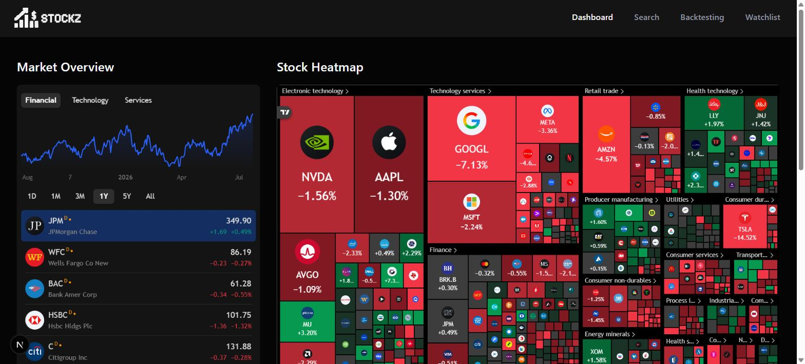
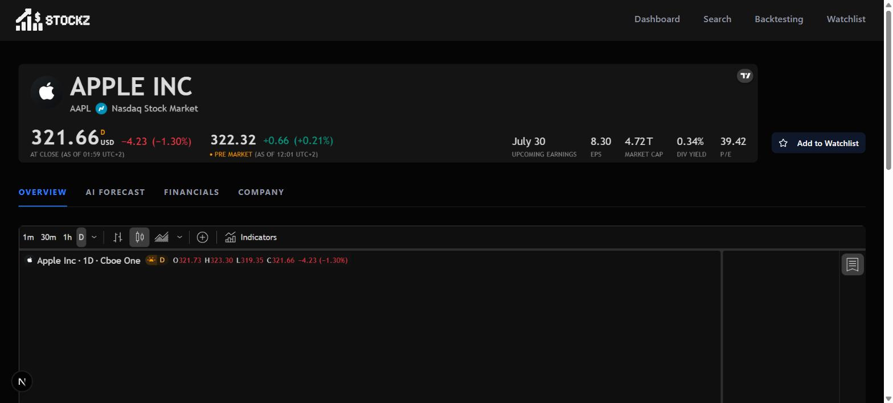
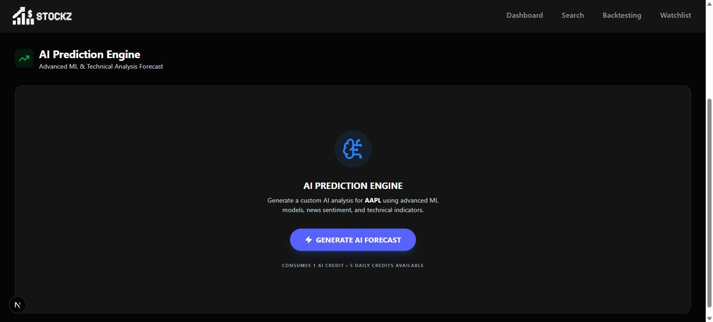
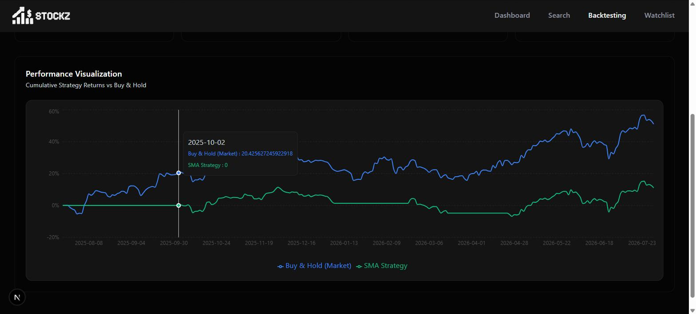

<div align="center">


### AI-assisted stock research, backtesting, and forecasting — no account required.

[](https://nextjs.org)
[](https://react.dev)
[](https://www.typescriptlang.org)
[](https://fastapi.tiangolo.com)
[](https://www.mongodb.com/atlas)

[Features](#features) · [Architecture](#architecture) · [Tech stack](#tech-stack) · [Getting started](#getting-started) · [API reference](#backend-api-reference)

</div>

<br />



<br />

## What is this?

Stockz is a full-stack market dashboard: a Next.js frontend embeds live TradingView widgets for charts, heatmaps and financials, while a companion Python service does the actual quantitative work — price forecasting with Prophet, news sentiment with FinBERT, and moving-average strategy backtesting. A Gemini model sits on top to turn the raw numbers into a plain-English buy/sell/hold read.

There's no login. Every visitor gets a private, cookie-scoped identity assigned by middleware on first request — that's what your watchlist and price alerts are keyed to, with no account or password anywhere in the flow.

## Features

- **Market dashboard** — TradingView market-overview chart and a sector-by-sector stock heatmap on the homepage.
- **Stock research pages** — per-symbol view with quote header, candlestick chart, technical-analysis widget, financials, and company profile, all via TradingView.
- **AI Prediction Engine** — on-demand analysis per stock combining a Prophet price forecast, FinBERT news sentiment, and technical indicators (SMA/EMA/RSI/MACD/Bollinger Bands/ATR computed in TypeScript), synthesized into a signal by Gemini. Capped at 5 generations/day per visitor.
- **Strategy backtesting** — run a dual moving-average crossover (20/50 SMA) strategy against historical data for any symbol and see total return, Sharpe ratio, win rate, max drawdown, and an equity curve vs. buy-and-hold.
- **Watchlist** — add/remove symbols, see live price, % change, market cap and P/E at a glance.
- **Price alerts** — define upper/lower price thresholds per symbol (currently stored and listed in the UI; the notification email templates exist but aren't wired to a scheduled check yet — see [Known limitations](#known-limitations)).
- **No accounts** — an anonymous device cookie replaces sign-up/sign-in entirely.

## A look inside

<table>
<tr>
<td width="50%">

<p align="center"><em>Per-stock research page — quote header, chart, and one-click watchlist toggle.</em></p>
</td>
<td width="50%">

<p align="center"><em>AI Prediction Engine — Prophet + FinBERT + technicals, synthesized by Gemini.</em></p>
</td>
</tr>
</table>


<p align="center"><em>Strategy backtesting — equity curve for the strategy vs. buy-and-hold, with performance stats.</em></p>

## Architecture

```
                     ┌─────────────────────────────────────────────┐
                     │                Browser                      │
                     │   TradingView embeds ·  anon_id cookie       │
                     └───────────────────┬───────────────────────--┘
                                          │ HTTPS
                     ┌───────────────────▼───────────────────────┐
                     │             Next.js (App Router)           │
                     │                                             │
                     │  proxy.ts ─ assigns anon_id on first hit    │
                     │  Server Components ─ pages, data fetching   │
                     │  Server Actions ─ lib/actions/*             │
                     │  Inngest ─ daily news-summary email cron    │
                     └─────┬───────────────┬───────────────┬───────┘
                            │               │               │
                   ┌────────▼──────┐ ┌──────▼──────┐ ┌──────▼───────┐
                   │   MongoDB      │ │  Finnhub    │ │  Gemini API  │
                   │  watchlist ·   │ │  quotes ·   │ │  signal      │
                   │  alerts ·      │ │  search ·   │ │  synthesis   │
                   │  AI usage quota│ │  news       │ │              │
                   └────────────────┘ └─────────────┘ └──────────────┘
                            │
                   ┌────────▼─────────────────────────────┐
                   │     FastAPI backend  (backend/)        │
                   │                                         │
                   │  /predict        Prophet forecast       │
                   │  /sentiment      FinBERT news sentiment │
                   │  /backtest       SMA crossover backtest │
                   │  /full-analysis  all three, cached      │
                   │                                         │
                   │  yfinance ── data source                │
                   │  cache/   ── on-disk JSON response cache │
                   └─────────────────────────────────────────┘
```

The frontend and backend are decoupled and deployed separately (see [`DEPLOYMENT.md`](DEPLOYMENT.md)): Next.js talks to FastAPI over plain HTTP via `BACKEND_URL` / `NEXT_PUBLIC_BACKEND_URL`, and FastAPI has no knowledge of Mongo, Finnhub, or the frontend's session model — it's a stateless numbers service with its own on-disk cache.

### Module map

| Path | Responsibility |
|---|---|
| `app/(root)/` | Dashboard, stock detail, watchlist, backtesting pages (Server Components) |
| `app/api/inngest/` | Webhook endpoint for the Inngest daily news-email job |
| `proxy.ts` | Assigns the anonymous visitor id — the only "auth" this app has |
| `components/` | Client + server React components (charts, tables, modals, nav) |
| `lib/actions/` | Server Actions — the app's real API surface (watchlist, alerts, ML analysis, Finnhub proxy) |
| `lib/ml/indicators.ts` | Technical indicator math (SMA, EMA, RSI, MACD, Bollinger, ATR) run in Node |
| `lib/inngest/` | Scheduled/event-driven functions (daily news digest) |
| `lib/nodemailer/` | Transactional email templates + sender |
| `database/` | Mongoose connection + models (`Watchlist`, `Alert`, `Usage`) |
| `backend/app.py` | FastAPI app — prediction, sentiment, backtest, full-analysis routes |
| `backend/models/` | `StockPredictor` (Prophet) and `SentimentAnalyzer` (FinBERT) |
| `backend/utils/backtest.py` | SMA-crossover backtest engine |

## Tech stack

| Layer | Technology |
|---|---|
| Frontend framework | Next.js 16 (App Router, Server Actions, Turbopack), React 19, TypeScript |
| Styling | Tailwind CSS 4, Radix UI primitives, shadcn-style components |
| Charts & market data UI | TradingView embedded widgets, Recharts |
| Backend service | Python 3, FastAPI, Uvicorn |
| Forecasting | Prophet (Meta) via `yfinance` historical data |
| Sentiment | FinBERT (`ProsusAI/finbert`) via 🤗 Transformers |
| Generative AI | Google Gemini (`@google/generative-ai`) |
| Database | MongoDB (Mongoose + native driver) |
| Market data | Finnhub API |
| Background jobs | Inngest (daily news-summary email) |
| Email | Nodemailer |

## Getting started

### Prerequisites

- [Node.js](https://nodejs.org/) 18+
- [Python](https://www.python.org/) 3.10+ (a compiler toolchain is required to build `numpy`/`prophet` on some platforms)
- A [MongoDB](https://www.mongodb.com/atlas) connection string
- API keys: [Finnhub](https://finnhub.io/) (required), [Google Gemini](https://aistudio.google.com/) (required for AI forecasts)

### 1. Clone and install

```bash
git clone <your-repository-url>
cd stockz
npm install
```

### 2. Configure environment variables

Create `.env` in the project root:

| Variable | Used by | Required |
|---|---|---|
| `MONGODB_URL` | Frontend — watchlist, alerts, AI usage quota | ✅ |
| `NEXT_PUBLIC_FINNHUB_API_KEY` | Frontend — quotes, search, news | ✅ |
| `FINNHUB_API_KEY` | Frontend server actions (same key, server-side) | ✅ |
| `GEMINI_API_KEY` | Frontend — AI signal synthesis; also used by the Python backend | ✅ |
| `BACKEND_URL` / `NEXT_PUBLIC_BACKEND_URL` | Frontend → FastAPI backend URL | ✅ (`http://localhost:8000` locally) |
| `NODEMAILER_EMAIL` / `NODEMAILER_PASSWORD` | Daily news-summary email | Optional |

Create `backend/.env` with `MONGODB_URL`, `GEMINI_API_KEY`, and `FINNHUB_API_KEY` (the backend doesn't touch Mongo directly today, but shares the same values for convenience).

### 3. Run both servers

```bash
# Terminal 1 — FastAPI backend (creates a venv and installs requirements on first run)
./start_backend.sh

# Terminal 2 — Next.js frontend
npm run dev
```

Open [http://localhost:3000](http://localhost:3000). The backend runs on [http://localhost:8000](http://localhost:8000).

See [`DEPLOYMENT.md`](DEPLOYMENT.md) for deploying the frontend to Vercel and the backend to Render.

## Backend API reference

All routes are served by `backend/app.py`, cached on disk under `backend/cache/` with a per-route TTL.

| Method & path | Description | Cache TTL |
|---|---|---|
| `GET /predict/{symbol}?days=30` | Prophet price forecast | 1h |
| `GET /sentiment/{symbol}` | FinBERT sentiment over recent news | 6h |
| `GET /backtest/{symbol}` | Dual SMA (20/50) crossover backtest | 24h |
| `GET /full-analysis/{symbol}?days=30` | Prediction + sentiment + backtest + OHLCV history in one call | 1h |

## Project structure

```
app/                Next.js App Router pages and API routes
  (root)/            Dashboard, stock detail, watchlist, backtesting
  api/inngest/        Inngest webhook
backend/             FastAPI service
  models/              StockPredictor (Prophet), SentimentAnalyzer (FinBERT)
  utils/               Backtesting engine
  cache/               On-disk response cache (generated)
components/          React components (charts, tables, nav, modals)
  ui/                  Design-system primitives (Radix-based)
database/            Mongoose connection + models
hooks/               Shared React hooks
lib/
  actions/             Server Actions — the app's API surface
  ml/                  Technical indicator calculations
  inngest/             Scheduled/event-driven functions
  nodemailer/          Email templates + sender
proxy.ts             Assigns the anonymous visitor cookie
```

## Known limitations

- **Price alerts don't send anything yet.** The email templates for upper/lower/volume alerts exist in `lib/nodemailer/template.ts`, but no scheduled job currently evaluates stored alerts against live prices — creating one only saves it for display in the watchlist.
- **Sentiment analysis needs extra Python packages.** `backend/requirements.txt` doesn't pin `transformers`/`torch`, so on a fresh install `SentimentAnalyzer` falls back to a neutral "Model Offline" result instead of running FinBERT. Install them manually if you need live sentiment.
- **AI forecast quota is per-device, not per-account.** Since there are no logins, the 5-per-day cap is tied to the anonymous cookie — clearing cookies resets it.

## Contributing

Issues and PRs are welcome. Please run `npm run lint` and make sure `npm run build` passes before submitting.

## License

No license has been specified for this project yet — all rights reserved by default. Open an issue if you'd like to use this code and need a license granted.
